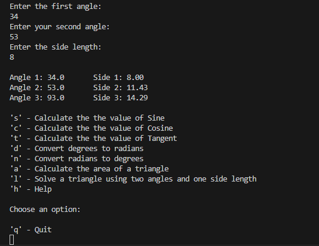

[Back to Portfolio](./)

Advanced Calculator 3000
===============

-   **Class:** CSCI 325
-   **Grade:** A
-   **Language(s):** Java
-   **Source Code Repository:** [Natemixon7/AdvancedCalculator3000](https://github.com/Natemixon7/AdvancedCalculator3000)  
    (Please [email me](mailto:NRMixon@csustudent.net?subject=GitHub%20Access) to request access.)

## Project description

This advanced mathematical calculator is designed to solve a wide range of problems with minimal input from the user. It operates by guiding users through a streamlined process based on the type of mathematical function selected from the start-up menu. Available options include arithmetic, algebra, trigonometry, and geometry. Once a selection is made, the calculator prompts the user to provide the required inputs and performs the computations to deliver accurate solutions efficiently.

## How to compile and run the program

```bash
cd AdvancedCalculator3000
code .
click run (play button) in top right of VS code
```

## UI Design

When the calculator is launched, the welcome screen offers four types of calculators to choose from (see Fig. 1). The Arithmetic Calculator allows users to perform five different mathematical operations on two input numbers, with the option to return to the main menu by typing 'q' (see Figs. 2 and 3). The Algebra Calculator supports four operations, which users can select after entering a quadratic equation (see Fig. 4). The Geometry Calculator prompts users to specify a shape and perform various operations based on the selected shape (see Fig. 5). The Trigonometry Calculator provides seven operations, including converting degrees to radians and calculating missing angles of a triangle (see Fig. 6). At any point while using a calculator, users can type 'h' to access detailed instructions for guidance (see Fig. 7).

  
Fig 1. Welcome screen.

  
Fig 2. Arithmetic options.

  
Fig 2. Return to select calculator.

  
Fig 4. Algebra options.

  
Fig 5. Geometry options.

  
Fig 6. Trigonometry options.

  
Fig 7. Help instructions.

## 3. Additional Considerations

This program was done completely in Java as a group project. It features math anywhere from basic to advanced. Adding additional operations or calculators would be quick and easy.

For more details see [GitHub Flavored Markdown](https://guides.github.com/features/mastering-markdown/).

[Back to Portfolio](./)
