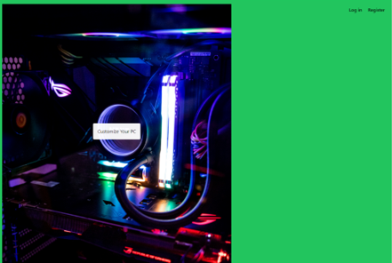

[Back to Portfolio](./)

CrowdControl
===============

-   **Class:** CSCI 499
-   **Grade:** A
-   **Language(s):** Python, HTML, PHP, CSS(Tailwind), MySQL, JavaScript
-   **Source Code Repository:** [Natemixon7/CrowdControl](https://github.com/Natemixon7/CrowdControl)  
    (Please [email me](mailto:NRMixon@csustudent.net?subject=GitHub%20Access) to request access.)

## Project description

CrowdControl is a web platform supported by a database that maintains up-to-date pricing information for computer components sourced from the web. The database is refreshed every 24 hours through an automated script, ensuring accurate and current pricing. The integrated web scraper also verifies compatibility between components, enabling users to configure a fully functional PC. Customers can customize their builds by selecting alternative parts from dropdown menus, helping them optimize performance and cost. Additionally, the website offers account registration and login features to enhance user experience and convenience.

## How to compile and run the program

```bash
Need to have Laravel set up on a computer
cd pcbuilder
php artisan serve
npm run dev
Go to localhost IP in your default browser
```

## UI Design

The website's welcome page features a prominent button directing users to customize their PC, along with login and registration options conveniently located in the top-right corner (see Fig. 1). The login page allows users to access their accounts by entering a valid email and password stored in the database (see Fig. 2). New users can register by clicking the green "Register" button, enabling them to create an account that will be securely stored in the database (see Fig. 3).

Once logged in, users are redirected to the customization page, where they can select desired components for their PC and submit their configuration using the button at the bottom of the page (see Fig. 4). After finalizing their selections and submitting the order, users are taken to the checkout page, which displays the ordered items and the total price of the custom PC (see Fig. 5).

  
Fig 1. Home Page

  
Fig 2. Login Page

  
Fig 3. Register Page

  
Fig 4. Customization Page

  
Fig 5. Checkout Page

## 3. Additional Considerations

To customize and place an order for a PC, users are required to log in. The login page includes a "Forgot Password" option, which allows users to request a password reset email for account recovery. All components are sourced through web scraping from reputable retailers such as Amazon and Newegg.

For more details see [GitHub Flavored Markdown](https://guides.github.com/features/mastering-markdown/).

[Back to Portfolio](./)
