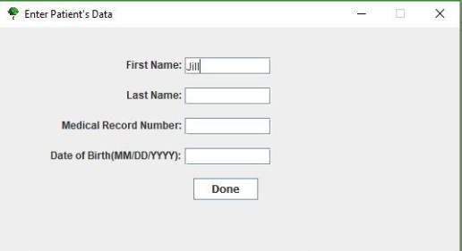

[Back to Portfolio](./)

HL7 Family Tree Converter
===============

-   **Class:** CSCI 495
-   **Grade:** A
-   **Language(s):** Java, XML, HL7
-   **Source Code Repository:** [Natemixon7/HL7FamilyConverter](https://github.com/Natemixon7/HL7FamilyTreeConverter)  
    (Please [email me](mailto:NRMixon@csustudent.net?subject=GitHub%20Access) to request access.)

## Project description

This tool processes HL7/XML files representing a patient's family relationships, enabling users to export updated XML/HL7 files that reflect added patients or restructured data. It is particularly beneficial for medical staff tasked with generating genealogy trees and streamlining workflows by allowing the reuse of existing XML/HL7 files without the need for manual file creation. The tool also includes features for modifying individual data, such as date of passing, relationship codes, and age, ensuring accuracy and flexibility in managing patient information.

## How to run the program (Windows)
1) Go to the [Releases](https://github.com/AlexThomp1/HL7FamilyTreeConverter/releases) section of this page
2) Download "HL7.Family.Tree.Converter.v1.0.Windows.exe" 
2.1) If Windows states the file is not secure, click "More Info" at the bottom, and click "Run Anyway" 
3) The program is now usable

## How to run the program (Mac, Linux, etc.)
1) Go to the [Releases](https://github.com/AlexThomp1/HL7FamilyTreeConverter/releases) section of this page
2) Download "HL7.Family.Tree.Converter.v1.0.Other.jar" 
3) Ensure you have the latest version of Java installed 
3.1) If Java is not installed, install it here based on your system: [Java Installation Link](https://www.java.com/en/download/manual.jsp)
4) Open the downloaded file
5) The program is now usable

## [Click Here for the Video Guide](https://www.youtube.com/watch?v=darrJ0l5nAI)

## UI Design

[User Manual](pdf/HL7FamilyTreeConverterUserGuide.pdf)

  
Fig 1. Main menu after launch

  
Fig 2. Add patient pop-up

  
Fig 3. Export menu

## 3. Additional Considerations

This tool only works for XML/HL7 files. It will not overwrite original files and instead generate new files.

For more details see [GitHub Flavored Markdown](https://guides.github.com/features/mastering-markdown/).

[Back to Portfolio](./)
