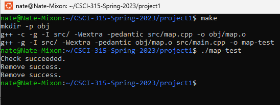

[Back to Portfolio](./)

Large Map
===============

-   **Class:** CSCI 315
-   **Grade:** B+
-   **Language(s):** C++
-   **Source Code Repository:** [features/mastering-markdown](https://guides.github.com/features/mastering-markdown/)  
    (Please [email me](mailto:NRMixon@csustudent.net?subject=GitHub%20Access) to request access.)

## Project description

This program maps student's first and last names to a nonnegative 32-bit integer. To ensure searching and removing can be done efficiently, the vector is sorted as the names are added. Binary search is used to efficiently find keys in order to add and remove keys. 

## How to compile and run the program

```bash
Need separate .txt files for first names and last names
make
./map-test
```

## UI Design

This program has no UI but there are lots of tests written in the test folder.

  
Fig 1. Compilation example

## 3. Additional Considerations

This project was graded based strictly on performance and did not require a UI. For a best understanding of the program look through the commented code and test cases. This program utilizes binary search and therefore the time complexity of the remove and get functions are O(log(n)).

For more details see [GitHub Flavored Markdown](https://guides.github.com/features/mastering-markdown/).

[Back to Portfolio](./)
