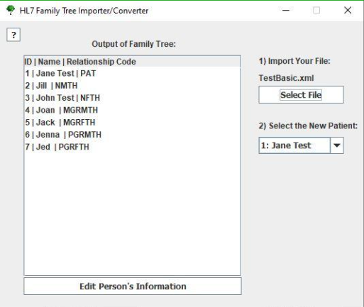

Portfolio
=========

Programming Projects
--------------------

*For access to my private project repositories, please [email me](mailto:NRMixon@csustudent.net?subject=GitHub%20Access) with the subject line, GitHub Access.

---
### [HL7 Family Converter | CSCI 495](HL7FamilyConverter)

---
### [CrowdControl | CSCI 499](MDs/CrowdControl)

---
### [Large Map | CSCI 315](LargeMap)

---
### [Advanced Calculator 3000 | CSCI 325](AdvancedCalculator3000)

---

Ethics Papers
-------------

### [Insider Betrayal and Vulnerable Government](/pdf/Snowden.pdf)

-   **Class:** CSCI 405
-   **Grade:** A

### [Who Can Write Code](/pdf/WhoCanWriteCode.pdf)

-   **Class:** CSCI 325
-   **Grade:** A+

### [Moral Duty of Computer Science Professional](/pdf/MoralDuty.pdf)

-   **Class:** CSCI 315
-   **Grade:** B+

---

Presentations
-------------

### [CrowdControl](/pdf/CrowdControl.pdf)

- **Class:** CSCI 499
- **Grade:** A

### [Advanced Calculator 3000](https://youtu.be/Y4LqBPU5FbU)

- **Class:** CSCI 325
- **Grade:** A

---

Page template forked from <a href="https://github.com/csu-cs/csci-portfolio">CSU-CS</a>

<!-- Remove above link if you don't want to attributive -->
